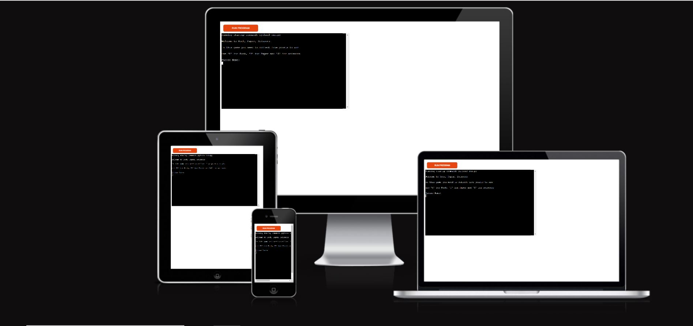
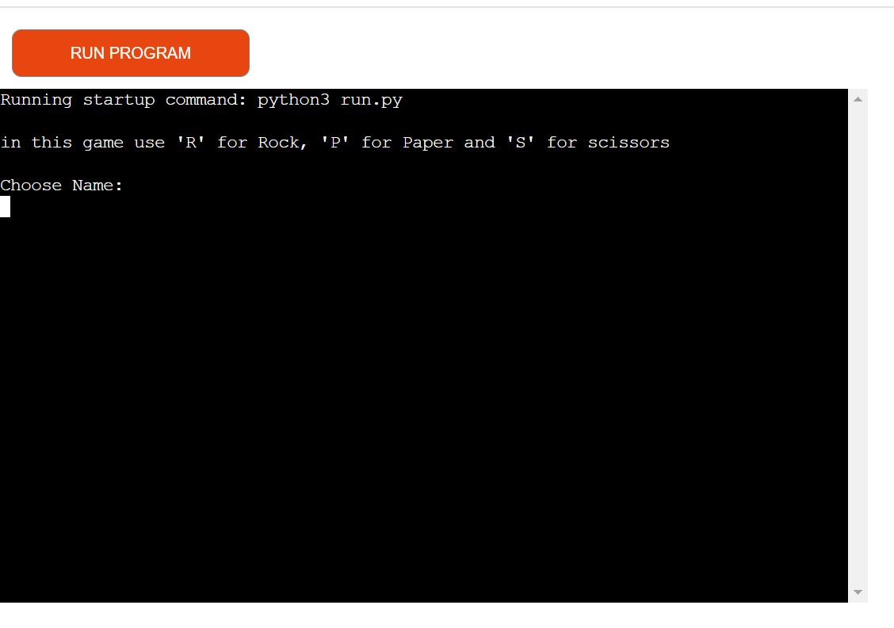
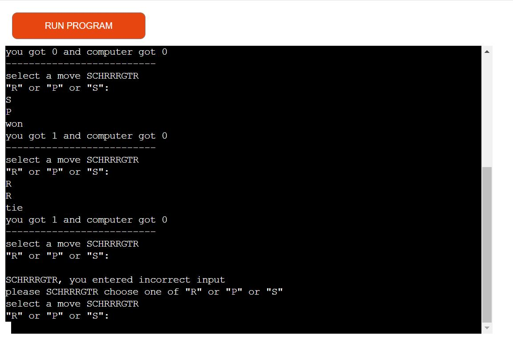
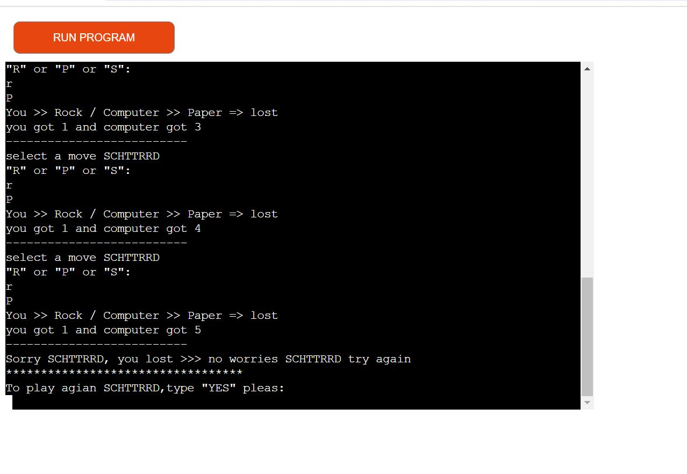
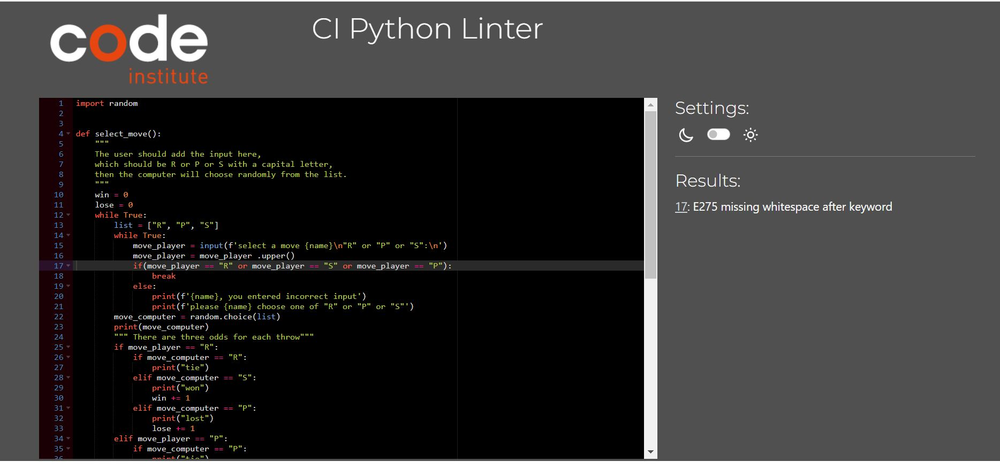
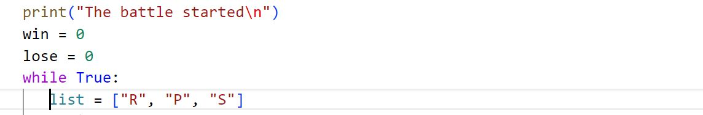
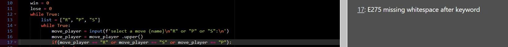

# Rock, Paper, Scissors
Rock, Paper, Scissors is a python terminal game that runs by render.

In this game, the player tries to make five points against the device to win the game.

link to the [Rock, Paper, Scissors](https://mypython.onrender.com/)

## About
In the game, the user plays against the computer, and the user needs to collect five points to win the game, otherwise the user will lose. In each round whoever throws the stronger hand will collect one point. The stronger hand is defined by the following rules: Rock beats Scissors, Scissors beats Paper, Paper beats Rock. If the same symbol is chosen by both user and the computer, it is a draw. Then the next round starts. If the result is a draw, neither the user nor the computer will collect a point.
The game will end as soon as either the user or the computer collects five points, until then the game will keep running.

## How To play
At the start of the game, a message will appear to the user describing to them what kind of input they are allowed to enter (which is R, P and S).
Then the user needs to enter their name to start the battle.
If the user enters a wrong input, the game will ask them again to enter one of the accepted options. 
This game uses symbols ("R" means Rock, "P" means Paper, and "S" means Scissors).
Whenever the user enters one of these symbols, the computer will do the same thing simultaneously, and whoever gets the stronger hand will collect one point and then the game will take them to the next round and so on.
The user has to collect five points against the computer to win the game.

## Features 
- Message to welcome the users.
- Message to describe how to finish the game.
- A message informs the user about what kind of input they can enter.
- Allows the user to enter their name.

- Play against the computer.
- Accept the user's input. 
- A message informs the user about incorrect input.
- The user can't enter any input except what is provided.
- Score panel.

- The game uses the user's name in messages.
- A message shows the result at the end of the game.
- The project gives the user the choice to either end the game or play again.

## Technologies Used
### Languages Used
[Python 3.8.5 ](https://www.python.org/downloads/release/python-385/)

## Deployment
The project is created by [render app](https://render.com/)

Steps to deployment:
- Clone repository.
- Sign in with render.
- Create a render app.
- Built a link to render the app with the repository.
  * Steps to built link
    - Click “New” then select “Web Service”
    - On the right side, select “Connect account” for GitHub
    - Select your GitHub account
    - Install all repositories is selected and click “Install”
- Here is the [Deploy](https://mypython.onrender.com/)

## Testing
- I have tested the project by the following points
- Passed the code to [PEP8](https://pep8ci.herokuapp.com/#).

- Tested the code manually.

### bugs

#### solved bugs
I had a problem with "indentation"

#### unsolved bugs
I can't add a whitespace after the keyword because the line will be too long.

## Credits
- Learning from [W3school](https://www.w3schools.com/js/default.asp)
- Learning and inspiration from [FreeCodeCamp](https://www.freecodecamp.org/)
- To show the program image on different devices [Am I Responsive](https://ui.dev/amiresponsive)
- To deploy the project I used [Render](https://render.com/) 
- It hosts the code of the project [GitHub](https://github.com/)
- Testing the code [PEP8](https://pep8ci.herokuapp.com/#)
- Deployment terminal by [CI](https://mypython.onrender.com/)

