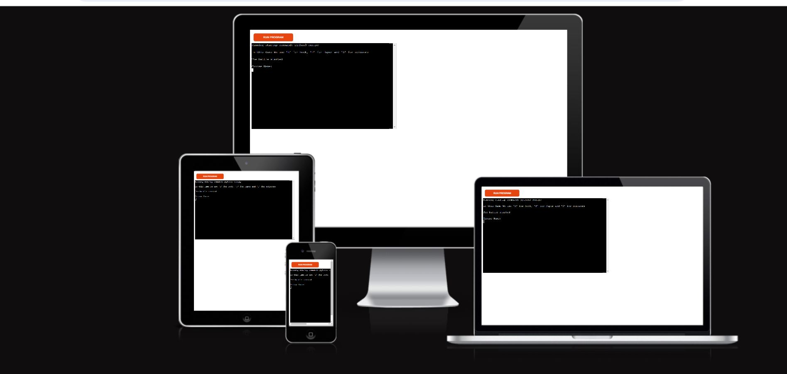

# Rock, Paper, Scissor
Rock, Paper, Scissor is a python terminal game,and it runs by render.

The plyer trys in this game to make five points against the device to win the game.

## About
In the game, the user plays against the computer, and the user needs to collect five points to win the game, rather than the user will lose. in each round whoever throws a strong hand will collect one point, then move to the next round, although when the result is tied none of them will collect a point.
the game will end as soon as one of them collects five points, rather then the game will keep running.

## How To play
At the start of the game, there is a message will appear to the user to describe to them what kind of input they allow to enter, rather than the game not running and it will ask them again to enter one of the correct inputs.
This game uses symbols ("R" means Rock, "P" means Paper and "S" means Scissor),
when the user enters one of these symbols, the computer will do the same thing, and whoever gets a strong hand will collect one point and then the game will take them to the next round and so on.
The user has to collect five points against the computer to win the game.
## Features 
## Data Model
## Technologies Used
### Languages Used
### Libraries 
## Deployment
## Testing
## Credits
### content
### Acknowledgments

